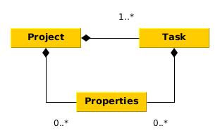
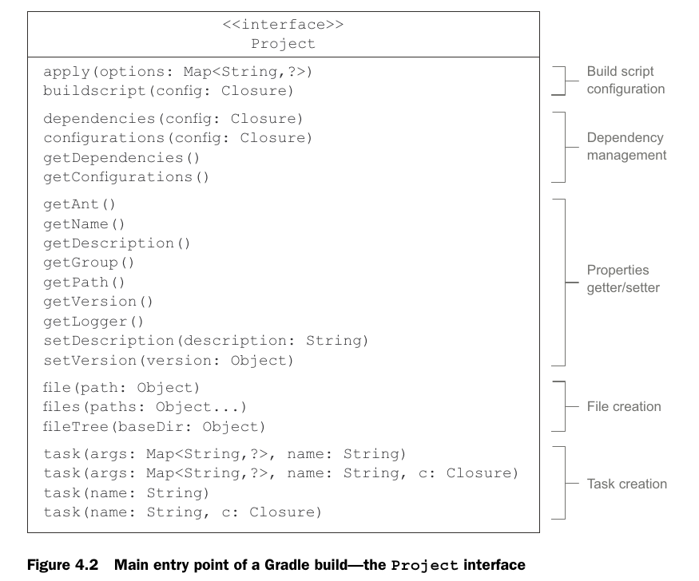
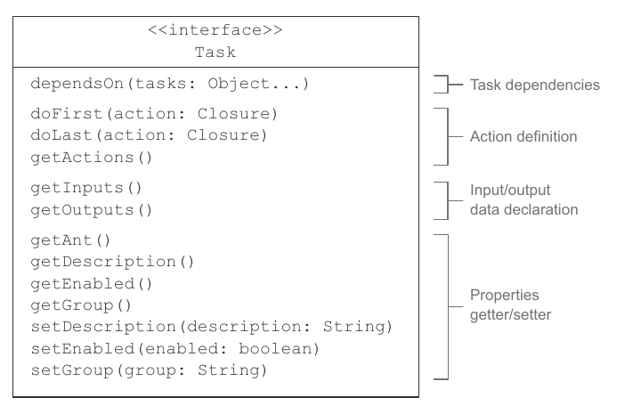
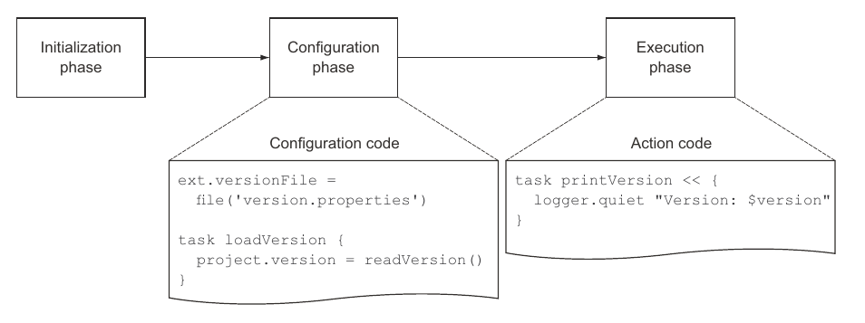
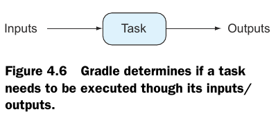
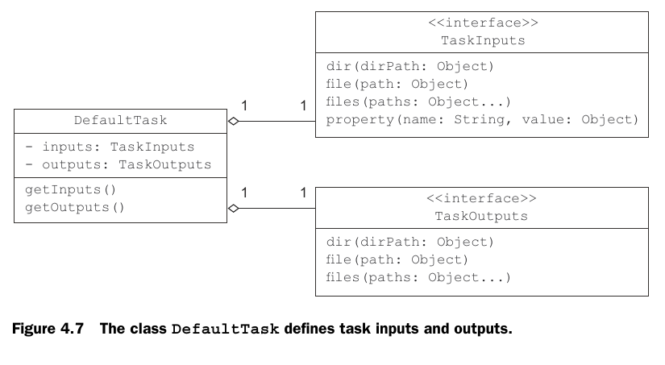
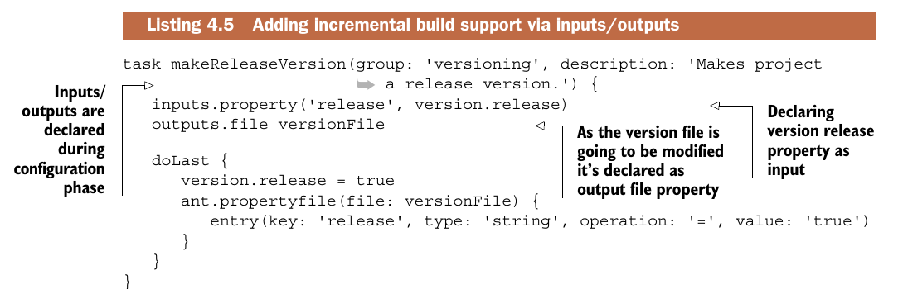

### Projects

* Каждый grade build состоит из проектов, которые состоят из задачь.
Задачи и проекты могут содержать в себе сойства, определяющие их поведение.


* Project - это интерфейс, доступен в build.gradle под
именем project (или без имени вовсе):

```java
project.setDescription('My Project')
println project.getDescription()
println getDescription()
```

* Task - это тоже интерфейс:


* Проекты и задачи имеют некоторое количество свойств,
доступных через setters\getters.
* Многие классы Gradle позволяют добавлять доп.
свойства используя пр-во имен ext. Такие свойства
хранятся ввиде Map<String,?>:

```java
project.ext.myProp = 'some value'
ext{
  myOtherProp='some value'
}
//после создания доп. свойства можно не использовать
//ext для доступа к нему
println project.myProp
myProp='some other value'
```
* gradle.properties позволяет указывать свойства
проекта:

```java
//gradle.properties
myProp='value'
//build.gradle
println project.myProp
```
### Tasks

* Задачи могут принадлежать к определенным группам и иметь описания, gradle tasks отражает это:

```java
task printVersion {
    group = 'versioning'
    description = 'Prints project version.'
    doLast {
      //gradle содержит свою реализацию логгера
      //на основе SLF4j
      logger.quiet "Version: $version"
    }
}
```
* задачи могу содержать любое количество closures
в doLast и doFirst:
```java
task someTask{
}
someTask.doLast {some action}
someTask.doLast {some other action}
```
* Finallizer tasks: задача second всегда выполняется
после задачи first и служит например для освобождения
ресурсов, используемых задачей first

```java
task first << { println "first" }
task second << { println "second" }
first.finalizedBy second
```

### Build Phases

* Инициализация: создается экз. project.
* Конфигурирование: происходит конфигурация всех объектов.
* Выполнение: выполняются указанные задачи.



### Task inputs and outputs


* В качестве входных данных задачи могут выступать:
директории,файлы, свойства.
* Выходные данные могут быть: директория, файлы


* Задача считается up-to-date если её входные и
выходные данные не изменились с момента последнего
запуска.
* Напишем задачу, которая изменяет версию на релиз:


