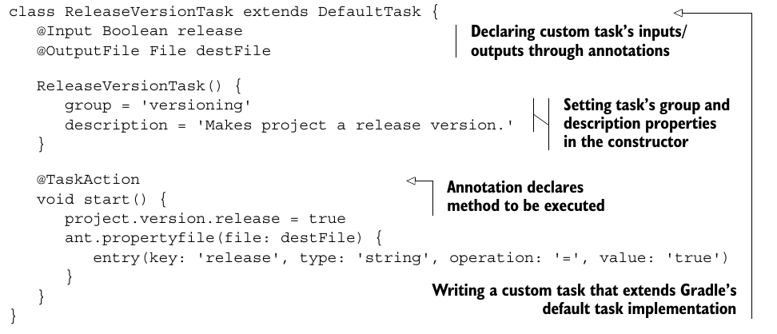
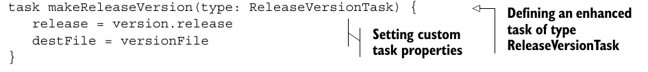

* можно вынести определение задачи в отдельный
groovy-класс:


* используем в build.gradle нашу задачу так:


* When you run Gradle, it checks for the existence of a directory called buildSrc. Gradle then automatically compiles and tests this code and puts it in the classpath of your build script. You don't need to provide any further instruction. This can be a good place to add your custom tasks and plugins.
For multi-project builds there can be only one buildSrc directory, which has to be in the root project directory.
* По умолчанию градл применяет следующий build.gradle к buildSrc:

```java
apply plugin: 'groovy'
dependencies {
    compile gradleApi()
    compile localGroovy()
}
```
