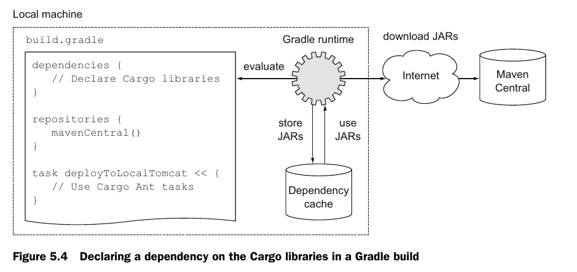
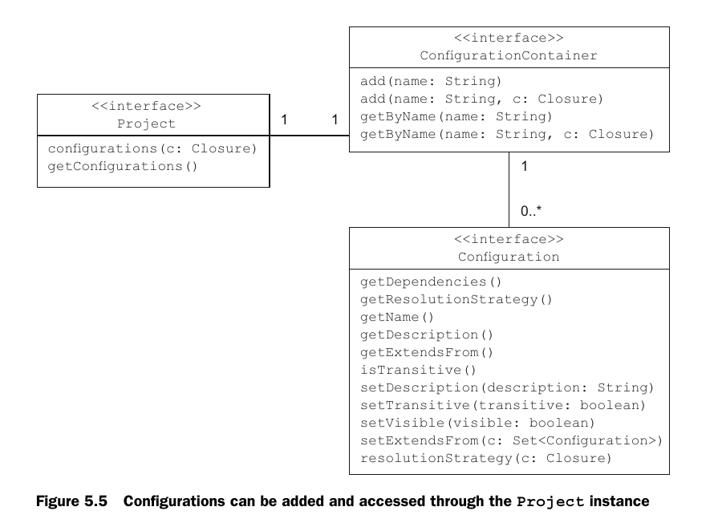
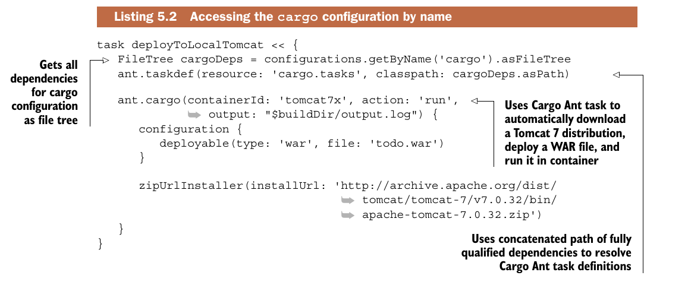

### Управление зависимостями.
1. Градл анализирует блоки dependencies, repositories
2. Скачивает нужные артефакты из репозиториев
3. Складывает скачанные фртефакты в локальный кеш (НЕ мавен-репозиторий!)



### Configurations
* Конфигурация может использоваться например для опреде-
ления области зависимости (п. compile).
* Конфигурации хранятся в каждом проекте в
экз. ConfigurationContainer.

* Объявим собственную конфигурацию, она будет содержать
зависимости для Cargo (Cargo - это установщик приложений в выбранный контейнер). Если этого не сделать, то библиотеки Cargo будут в classpath.
```java
configurations {
    cargo { //имя конфигурации
        description = 'Classpath for Cargo Ant tasks.'
        visible = false //в мултимодульном проекте
        //другие модули не увидят этой конфигурации
    }
}
```
* Теперь новая конфигурация доступна с именем Cargo
* Используя ант можно скачать tomcat и добавить в cp для деплоя в контейнер нужные зависимости из конфигурации cargo:

