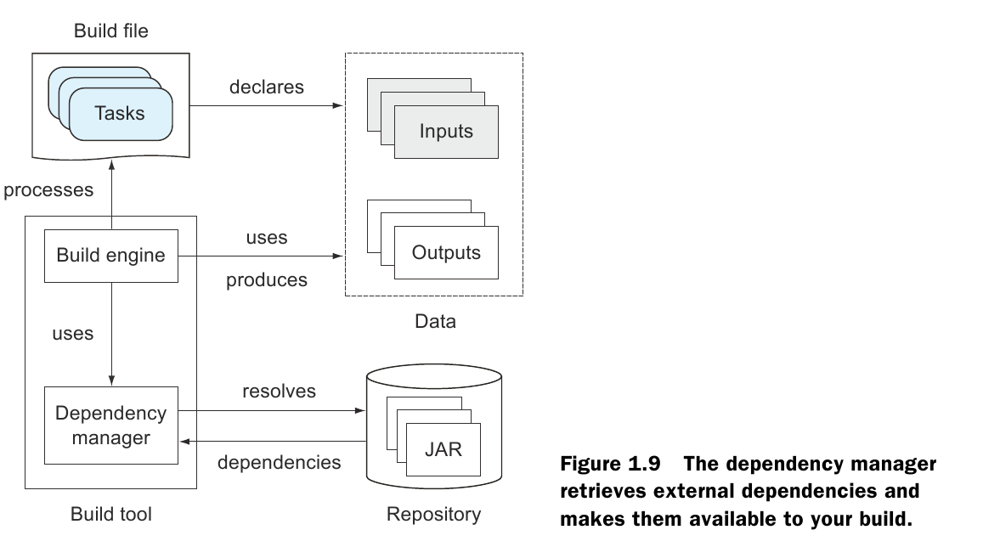

### Сборки
* Scheduled Build - это процесс сборки и тестирования инициируемый в определенное время.
* Triggered Build - это процесс сборки и тестирования инициируемый некоторым действием (например появлением нового коммита в VCS).
* Continious Integration (CI) - это система, реализующая scheduled and triggered builds.
Процессы сборки происходят не зависимо от настроек конкретных машин разработчиков.

### Графы
* Граф - это набор вершин и связей между ними.
* Направленный граф - это граф у которого связи имеют направление.
* Направленный ацикличный граф - это направленный граф, у которого отсутствуют циклы.
* Build Tools работают по принципу направленного ацикличного графа:
1. ацикличность - каждая задача должна быть выполнена один раз.
2. направленность - задачи зависят от других задач.

### Build Tools
* Build File (Build Script) - это файл, содержащий граф задачь.
* A task takes an input, works on it by executing a series of steps, and produces an output.
* Build Engine - это часть build tool, обрабатывающий инструкции build file.
* Dependency Manager - это часть build tool для обработки зависимостей
с использованием репозитория.

