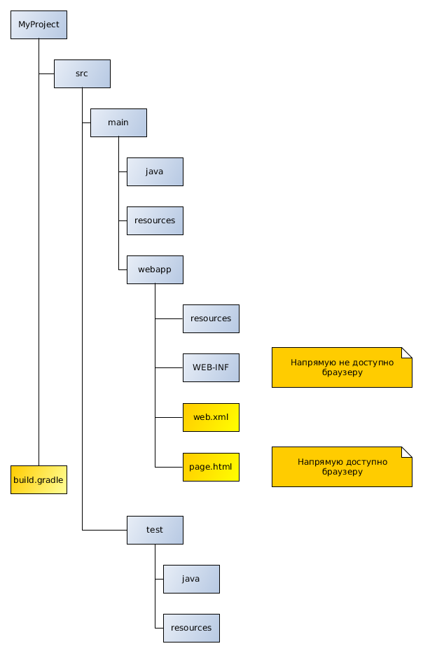

### Плагины

* Плагин - это расширение Gradle добавляющее готовые задачи.

### Java Plugin

* Java plug-in добавляет задачи : test, build, jar.
* Добавляет области:
	compile - транзитивна,есть в рантайме и при компиляции (main и test)<br>
	testCompile не транзитивна, есть в рантайме тестов и при компиляции тестов<br>
	compileOnly не транзитивна, есть только при компиляции main, отсутствует в тестах<br>
* Добавим java plugin в build.gradle:
```java
apply plugin: 'java'
//apply plugin: 'war'
group = 'theGroup'
version = 'theVersion'
sourceCompatibility = theSourceCompatibility
targetCompatibility = theTargetCompatibility
compileJava.options.encoding = 'UTF-8'
compileTestJava.options.encoding = 'UTF-8'
```
* Структура проекта должна быть такой:



* Сборка проекта:
```bash
gradle build
```


### Application plugin

* автоматически добавляются java и distribution плагины
```java
  apply plugin: 'application'
  mainClassName = "org.gradle.sample.Main"
```
* запуск осуществляется задачей run
```bash
  gradle run
```
* fat jar
```java
   jar {
    from(configurations.compile.collect { it.isDirectory() ? it : zipTree(it) }) {
        exclude "META-INF/*.SF"
        exclude "META-INF/*.DSA"
        exclude "META-INF/*.RSA"
    }

    manifest {
        attributes 'Implementation-Title': 'Foobar',
                'Implementation-Version': version,
                'Built-By': System.getProperty('user.name'),
                'Built-Date': new Date(),
                'Built-JDK': System.getProperty('java.version'),
                'Main-Class': mainClassName
    }
}
```

### Maven Plugin

* загрука артефактов в мавен

```java
   apply plugin: 'maven'

    uploadArchives {
        repositories {
            mavenDeployer {
                repository(url: "file:///root/.m2/repository")
            }
        }
    }
    gradle uploadArchives
```

### settings.gradle

* имя проекта и имена модулей
settings.grdadle

```java
rootProject.name = 'theName'
//submodules defined here
include 'chapter1','chapter2','chapter3',"chapter5/example"
//change submodule name
project(":chapter16").name = "chapter16 - rest"
```

* чтобы сконфигурировать модули проекта надо:
  1. добавить их в settings.gradle
  2. то, что  будет применено к подпроектам обернуть в build.gradle
```java
  subprojects { ... }
```
* показать все проекты
```bash
gradle -q projects
```
* построить один подпроэкт
```bash
gradle :Chapter4-persistence/CacheQueries:build
```

### Добавление зависимостей

* зависимости добавляются в build.gradle по GAV:

```java
dependencies {
    compile group: 'org.apache.commons', name: 'commons-lang3', version: '3.1'
    compile group: 'org.apache.commons', name: 'commons-lang3', version: '3.1',classifier:'javadoc'
    compile group: 'org.apache.commons', name: 'commons-lang3', version: '3.1',classifier:'sources'

}
```
* добавим репозиторий maven central:

```java
repositories {
    mavenCentral()
    mavenLocal()
}
```
* можно указать и url:

```java
repositories {
  maven {
      url "http://repo.mycompany.com/maven2"
  }
}
```

### Зависимости между модулями

settings.gradle - root project
```java
include 'api', 'shared','services:personService'
```
build.gralde - root project

```java
project(':api') {
    dependencies {
        compile project(':shared')
    }
}
project(':services:personService') {
    dependencies {
        compile project(':shared'), project(':api')
    }
}
```
Порядок билда: :shared,:api,:services:personService.
В :api будут добавлены зависимости сам :shared + транзитивные зависимости :shared.
Аналогино в :services:personService

* Скопируем все зависимости в каталог libs
```java
task libs(type: Copy) {
        into "$buildDir/libs"
        from configurations.runtime
    }
```

### gradle.properties

* gradle.properties - это файл в котором можно указывать  свойста gradle и переменные JVM
которые указываются через -D при старте jvm.
```properties
//настройки градл
org.gradle.logging.level=(quiet,warn,lifecycle,info,debug)
//java system properties java -DcacheSize=500
systemProp.chacheSize=500
```
