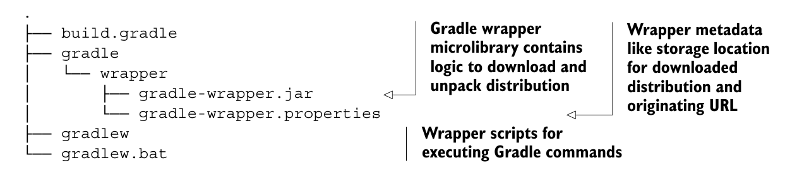
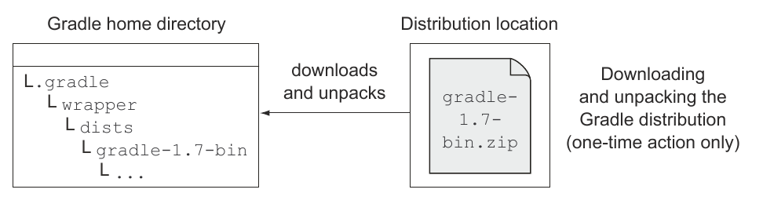

### gradle wrapper
* Используется для того, чтобы запустить сборку на машине без установленного gradle,
создает скрипты gradlew,gradlew.bat для автоматического скачивания gradle и запуска задачь проекта.
* Добавим задачу в build.gradle
```Java
task wrapper(type:  Wrapper){
    gradleVersion = '1.7'
}
```
* выполним задачу:
```
gradle wrapper
```
после выполнения будут созданы:
  1. командные файлы (служат для запуска gradle),
  2. файл загрузчика и
  3. файл конфигурации gradle:
  
* выполним задачу jettyRun используя gradlew,
при этом будет создан каталог<b> $HOME_DIR/.gradle/wrapper/dists</b>
, куда будет загружен
gradle, имеено он и будет использоваться для выполнения задачи:
```
gradlew.bat jettyRun
```

